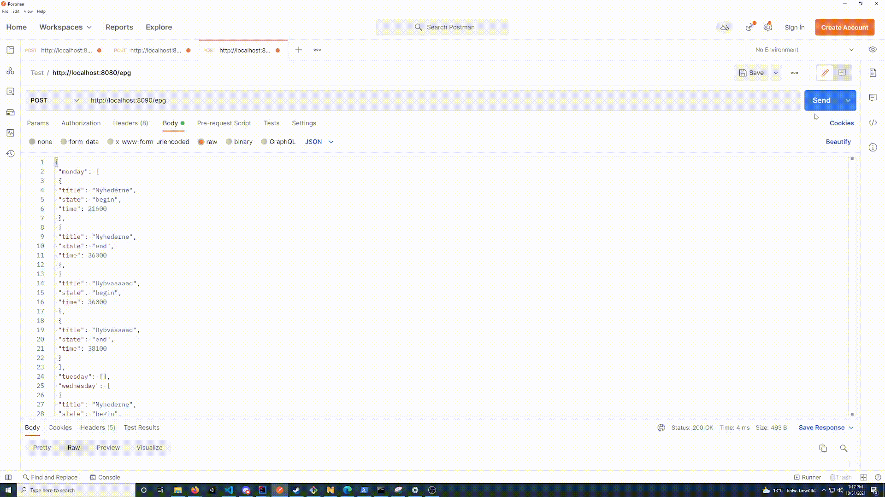

# Readme
This repository contains a simple POST REST API that accepts JSON and outputs to a more human friendly readable output.
A movie is defined by a begin and end states. It is assumed that only one movie is present in a time slot (duration between begin and end).

# Demo


## Demo Output
```
Monday
Nyhederne 06:00 - 10:00
Dybvaaaaad 10:00 - 10:35

Tuesday
Nothing to air today.

Wednesday
Nyhederne 06:00 - 12:00, 21:00 - 21:30
Fodbold 14:00 - 15:30

Thursday
ESL 12:00 - 13:00
ESLPro 23:00 - 01:00

Friday
Nothing to air today.

Saturday
Comedy 14:30 - 16:30
Nybyggerne 22:40 - 01:30

Sunday
Dybvvvvvad 11:30 - 12:00
```

## Input
The data has to specify each day of the week. A movie is defined by a `title`, a `state` that informs wether the movie is starting or ending and finally a `time` defined in seconds.


```json
{
 "monday": [
  {
    "title": "Movie",
    "state": "begin",
    "time": 21600
  },
  {
    "title": "Movie",
    "state": "end",
    "time": 37000
  }
 ],
 "tuesday": [],
 "wednesday": [],
 "thursday": [],
 "friday": [],
 "saturday": [],
 "sunday": []
}
```

## Output
The expected output will be which movie is running on which day and the duration.
```
Monday
Movie 06:00 - 10:16

Tuesday
Nothing to air today.

Wednesday
Nothing to air today.

Thursday
Nothing to air today.

Friday
Nothing to air today.

Saturday
Nothing to air today.

Sunday
Nothing to air today.
```

# Requirements for usage:
- [JDK 11 +](https://www.oracle.com/java/technologies/downloads/)
- [Gradle 7.2 +](https://gradle.org/install/)
- [IntelliJ](https://www.jetbrains.com/idea/download/)

# Resources used:
- [Building a RESTful Web Service](https://spring.io/guides/gs/rest-service/)
- [Spring Boot - RESTful Web Service with POST Request in JSON Example](https://www.youtube.com/watch?v=RydAmQvcqL8)
- 
